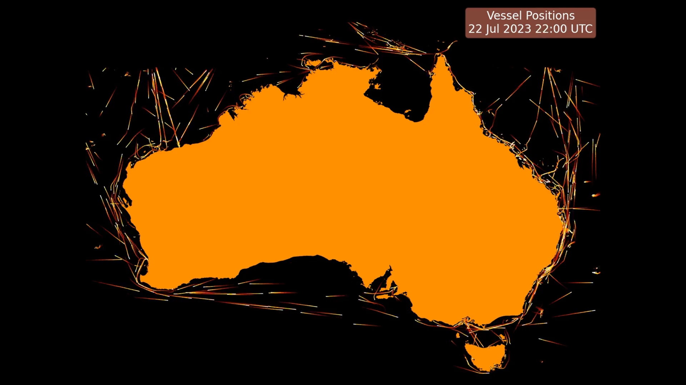

# Visualise AMSA Vessel Positions

A few different visualisations of the Australian Maritime Safety Authory (AMSA) vessel position data.

The code in this repo depends on data formatted with the scraping and data preparation scripts in my [scrape_amsa_vessel_positions repo](https://github.com/owenlamont/scrape_amsa_vessel_positions).

Currently this is in a very rough state, there's a [single notebook](plot_movement.ipynb) - which I used to create this [animation of vessel positions](https://youtu.be/c28lxm8V5vw) over the course of one year.

I plan to revisit this repo some more to refactor the notebook into separate data preparation and visualisation scripts and give some additional visualisation examples.
